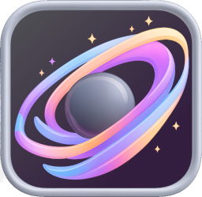

#  **Carbon Candy — Dark Theme Pack**
### A bold, neon-contrasted dark theme collection for VS Code  
Inspired by **Oxocarbon**, sweetened with vibrant candy-like colors.

 

  

 

 
built by Viral Team

---

## ✨ Overview

**Carbon Candy** delivers a family of dark themes blending deep carbon tones with vivid candy-style highlights — pink, purple, gradients, and more.

Built on the elegance of **Oxocarbon**, this pack enhances syntax clarity while adding personality through energetic and playful color contrasts.

From refined anthracite to expressive neon palettes, Carbon Candy offers a sweet selection of moods for every developer.

## 🎨 Theme Variants Included

### **🖤 Core Dark Variants**
- **Anthracite** — Deep slate gray foundation
- **Dark** — Rich charcoal base
- **Graphene** — Balanced carbon black with vibrant accents

### **🌈 Graphene Gradient Variants**
Smooth, carbon-inspired multi-tone transitions:
- **Graphene Gradient v1** — Subtle teal-to-blue fade
- **Graphene Gradient v2** — Purple-to-pink gradient flow
- **Graphene Gradient v3** — Cool cyan progression
- **Graphene Gradient v4** — Warm amber-to-orange blend

### **🍬 Graphene Solid Candy Colors**
Punchy, vibrant, and high-contrast variants:
- **Pink** — Hot magenta accents on deep carbon
- **Purple** — Royal violet highlights on dark base
- **Bee** — Bumblebee yellow accents on dark base

### **✨ Minimalist & Focus Variants**
Clean, borderless designs for maximum clarity:
- **Palenight** — Classic purple-tinted dark theme with cyan foreground
- **Carbon** — Deep focus theme with neutral gray palette
- **Obsidian** — Ultra-minimalist near-black with fully transparent borders
- **Aurora** — Crisp, clean variant with teal accents and excellent readability

---

## 📦 Installation

1. Open **Extensions** in VS Code  
2. Search for **“Carbon Candy”**  
3. Click **Install**  
4. Open the Command Palette → **“Preferences: Color Theme”**  
5. Choose your favorite Carbon Candy variant  
6. Enjoy the neon-sweet darkness 🍬✨

---

## 🛠️ Why Choose Carbon Candy?

- **14 unique theme variants** to match any preference
- Deep, eye-friendly dark backgrounds (ranging from near-black to charcoal)
- Bright neon candy accents for excellent syntax visibility
- Visually striking contrast without sacrificing readability
- Multiple aesthetic moods:
  - **Classic** — Anthracite, Dark, Graphene
  - **Gradient** — Smooth multi-tone transitions (v1–v4)
  - **Playful** — Pink and Purple with candy-style pops
  - **Minimalist** — Palenight, Carbon, Obsidian, Aurora with borderless design
- Optimized for:
  - Java
  - Kotlin
  - Python
  - TypeScript / JavaScript
  - JSON
  - Markdown
  - CSS / HTML
  - and more
- Compatible with:
  - VS Code
  - Antigravity

### **Color Palette Highlights**
- **Backgrounds**: `#000000` to `#292D3E` (pure black to purple-tinted)
- **Foregrounds**: `#D4D4D4` to `#EEFFFF` (neutral to cyan-white)
- **Syntax Tokens**: Vibrant candy colors
  - Blues: `#82AAFF`
  - Greens: `#C3E88D`
  - Reds: `#f07178`
  - Magentas: `#C792EA`
  - Yellows: `#FFCB6B`
  - Cyans: `#89DDFF`
  - Oranges: `#F78C6C`

---

## 🖼️ Screenshots

### Carbon Candy Pink

### Carbon Candy Purple

### Many combinations

---

## 📄 Changelog

See the full changelog in [`CHANGELOG.md`](./CHANGELOG.md).

---

## 🔖 License

This project is released under the MIT License.  
See [`LICENSE`](./LICENSE).

---

## Credits & Attributions

Carbon Candy’s file icons are inspired by and partially derived from open-source resources:

- **Symbol Icons** — https://github.com/miguelsolorio/vscode-symbols  
- **Oxocarbon-5** — https://github.com/DaKili/oxocarbon-5
- Additional SVG assets adapted and recolored for Carbon Candy

All referenced materials are used under their respective open-source licenses.  
Special thanks to the authors and contributors of these projects for their excellent work.

Thanks for using **Carbon Candy**!  
If you enjoy it, please ⭐ the extension or leave a review.

